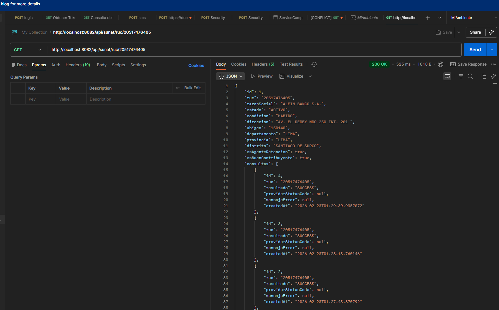
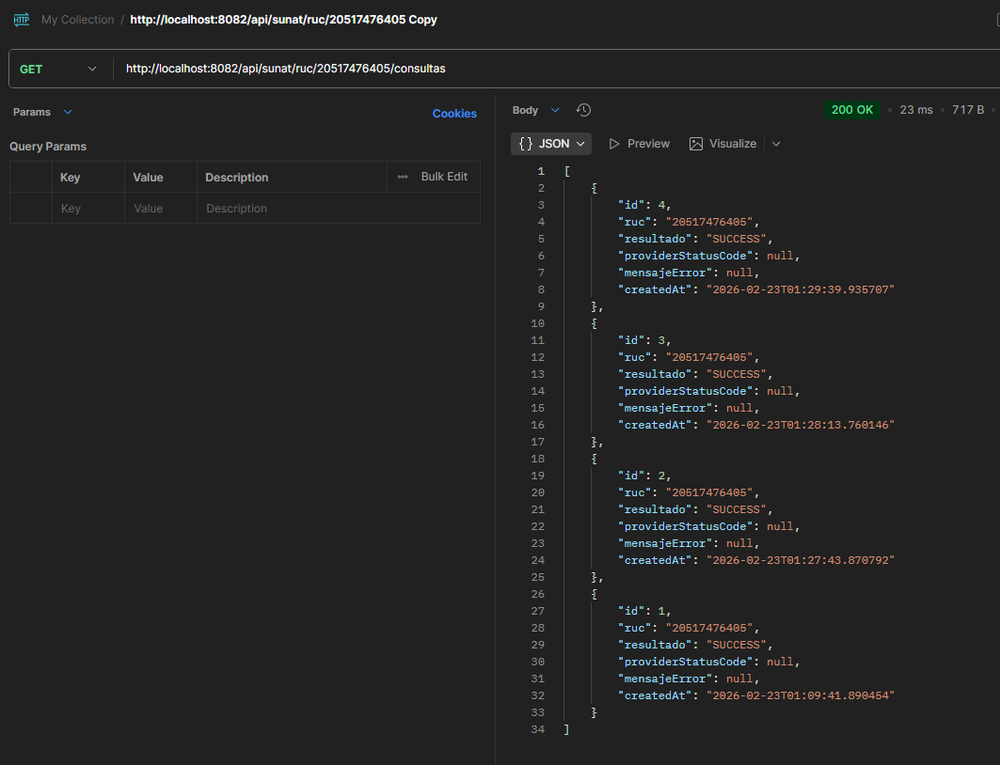

# Sunat Consulta API

API REST desarrollada con **Spring Boot 3.4.3** que permite consultar información de contribuyentes por RUC a través del proveedor [Decolecta](https://api.decolecta.com), persistir los resultados en PostgreSQL y consultar el historial de búsquedas.

---

## Tecnologías

| Tecnología | Versión |
|---|---|
| Java | 17 |
| Spring Boot | 4.0.2 |
| Spring Cloud OpenFeign | 2025.0.0 |
| Spring Data JPA | 4.0.2 |
| PostgreSQL | 15+ |
| Lombok | latest |

---

## Requisitos previos

- Java 17+
- Maven 3.8+
- PostgreSQL 15 corriendo en `localhost:5432`
- Base de datos `sunat_db` creada

---

## Configuración de la base de datos

```sql
CREATE DATABASE sunat_db;
```

> El esquema de tablas se genera automáticamente con `ddl-auto=update` al iniciar la aplicación.

---

## Configurar DECOLECTA_TOKEN

El token del proveedor **no está hardcodeado**. Debe definirse como variable de entorno antes de correr la aplicación.

### Opción 1 — Terminal (Windows CMD)
```cmd
set DECOLECTA_TOKEN=sk_13498.4LvqG9FiCp9sb0I93HNmW2QQFrm6kMS2
```

### Opción 2 — Terminal (PowerShell)
```powershell
$env:DECOLECTA_TOKEN="sk_13498.4LvqG9FiCp9sb0I93HNmW2QQFrm6kMS2"
```

### Opción 3 — IntelliJ IDEA
```
Run → Edit Configurations → Environment variables:
DECOLECTA_TOKEN=sk_13498.4LvqG9FiCp9sb0I93HNmW2QQFrm6kMS2
```

### Opción 4 — Variable de sistema (permanente)
```
Panel de control → Sistema → Variables de entorno → Nueva variable de sistema
Nombre:  DECOLECTA_TOKEN
Valor:   sk_13498.4LvqG9FiCp9sb0I93HNmW2QQFrm6kMS2
```

---

## Cómo correr el proyecto

### 1. Clonar el repositorio
```bash
git clone <url-del-repositorio>
cd sunat-consulta
```

### 2. Configurar el token (ver sección anterior)

### 3. Compilar y correr
```bash
mvn clean install
mvn spring-boot:run
```

O con el token en una sola línea:
```bash
DECOLECTA_TOKEN=sk_13498.4LvqG9FiCp9sb0I93HNmW2QQFrm6kMS2 mvn spring-boot:run
```

La aplicación estará disponible en: `http://localhost:8080`

---

## Endpoints

| Método | Endpoint | Descripción |
|---|---|---|
| `GET` | `/api/sunat/ruc/{ruc}` | Consulta RUC al proveedor y guarda resultado |
| `GET` | `/api/sunat/ruc/{ruc}/consultas` | Historial de consultas de un RUC |

### Validaciones
- `{ruc}` debe tener exactamente **11 dígitos numéricos**
- Si el formato es inválido → `400 Bad Request`
- Si el proveedor responde con error → se registra como `ERROR` y retorna el mensaje del proveedor

---

## Scripts de ejemplo

### Con cURL

#### Consultar RUC válido
```bash
curl -X GET http://localhost:8080/api/sunat/ruc/20601030013
```

#### Consultar RUC inválido (formato incorrecto)
```bash
curl -X GET http://localhost:8080/api/sunat/ruc/123
```

#### Ver historial de consultas
```bash
curl -X GET http://localhost:8080/api/sunat/ruc/20601030013/consultas
```

---

### Con Postman

Importa la siguiente colección o crea los requests manualmente:

**Request 1 — Consultar RUC válido**
```
Method:  GET
URL:     http://localhost:8080/api/sunat/ruc/20601030013
Headers: (ninguno requerido)
```

**Request 2 — Consultar RUC inválido**
```
Method:  GET
URL:     http://localhost:8080/api/sunat/ruc/123
Headers: (ninguno requerido)
```

**Request 3 — Historial de consultas**
```
Method:  GET
URL:     http://localhost:8080/api/sunat/ruc/20601030013/consultas
Headers: (ninguno requerido)
```

---

## Evidencia de pruebas

### Prueba 1 — RUC válido (SUCCESS)

**Request:**
```
GET http://localhost:8080/api/sunat/ruc/20601030013
```

**Response `200 OK`:**
```json
{
  "id": 1,
  "ruc": "20601030013",
  "razonSocial": "REXTIE S.A.C.",
  "estado": "ACTIVO",
  "condicion": "HABIDO",
  "direccion": "CAL. RICARDO ANGULO RAMIREZ NRO 745 DEP. 202 URB. CORPAC",
  "ubigeo": "150131",
  "departamento": "LIMA",
  "provincia": "LIMA",
  "distrito": "SAN ISIDRO",
  "esAgenteRetencion": false,
  "esBuenContribuyente": false,
  "consultas": [
    {
      "id": 1,
      "ruc": "20601030013",
      "resultado": "SUCCESS",
      "providerStatusCode": null,
      "mensajeError": null,
      "createdAt": "2026-02-23T00:15:32.123"
    }
  ]
}
```

---

### Prueba 2 — RUC inválido por formato (ERROR de validación)

**Request:**
```
GET http://localhost:8080/api/sunat/ruc/123
```

**Response `400 Bad Request`:**
```json
{
  "message": "RUC debe tener exactamente 11 dígitos"
}
```

---

### Prueba 3 — RUC no encontrado en proveedor (ERROR del proveedor)

**Request:**
```
GET http://localhost:8080/api/sunat/ruc/99999999999
```

**Response `400 Bad Request` (o el status que retorne el proveedor):**
```json
{
  "message": "ruc no valido"
}
```

> La consulta queda registrada en BD con `resultado: ERROR`, `providerStatusCode` y `mensajeError`.

---

## Script SQL de creación (DDL)

> La aplicación genera las tablas automáticamente con `spring.jpa.hibernate.ddl-auto=update`.
> Si prefieres crearlas manualmente, usa el siguiente script:

```sql
CREATE TABLE IF NOT EXISTS companies (
    company_id      BIGSERIAL PRIMARY KEY,
    ruc             VARCHAR(11)  NOT NULL UNIQUE,
    razon_social    VARCHAR(255) NOT NULL,
    estado          VARCHAR(50)  NOT NULL,
    condicion       VARCHAR(50)  NOT NULL,
    direccion       VARCHAR(255),
    ubigeo          VARCHAR(6),
    departamento    VARCHAR(100),
    provincia       VARCHAR(100),
    distrito        VARCHAR(100),
    es_agente_retencion    BOOLEAN NOT NULL DEFAULT FALSE,
    es_buen_contribuyente  BOOLEAN NOT NULL DEFAULT FALSE,
    created_at      TIMESTAMP    NOT NULL
);

CREATE TABLE IF NOT EXISTS consultas (
    id                   BIGSERIAL PRIMARY KEY,
    ruc                  VARCHAR(11)  NOT NULL,
    resultado            VARCHAR(20)  NOT NULL,
    provider_status_code INTEGER,
    mensaje_error        VARCHAR(500),
    razon_social         VARCHAR(255),
    estado               VARCHAR(50),
    condicion            VARCHAR(50),
    direccion            VARCHAR(255),
    ubigeo               VARCHAR(6),
    departamento         VARCHAR(100),
    provincia            VARCHAR(100),
    distrito             VARCHAR(100),
    es_agente_retencion    BOOLEAN NOT NULL DEFAULT FALSE,
    es_buen_contribuyente  BOOLEAN NOT NULL DEFAULT FALSE,
    company_id           BIGINT REFERENCES companies(company_id),
    created_at           TIMESTAMP NOT NULL
);

CREATE INDEX IF NOT EXISTS idx_consultas_ruc_created_at
    ON consultas(ruc, created_at DESC);
```

---

## Estructura del proyecto

```
src/main/java/com/sunat_consulta/sunat_consulta/
├── SunatConsultaApplication.java
├── client/
│   └── SunatApiClient.java          # Feign client → Decolecta API
├── config/
│   └── SunatFeignConfig.java        # Bearer token + ErrorDecoder
├── controller/
│   └── SunatController.java         # Endpoints REST
├── service/
│   └── SunatService.java            # Lógica de negocio
├── mapper/
│   └── SunatMapper.java             # DTO ↔ Entity
├── exception/
│   ├── ProviderException.java
│   └── GlobalExceptionHandler.java  # @RestControllerAdvice
├── dto/
│   ├── CompanyResponse.java
│   ├── ConsultaResponse.java
│   ├── SunatRucResponse.java
│   └── ProviderErrorResponse.java
├── entity/
│   ├── Company.java
│   └── Consulta.java
├── repository/
│   ├── CompanyRepository.java
│   └── ConsultaRepository.java
└── enums/
    ├── EstadoContribuyente.java
    ├── CondicionDomicilio.java
    └── ResultadoConsulta.java
```
 evidencias de consultas

 evidencia historial de consultas
